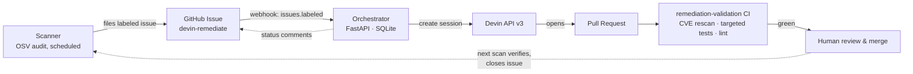

# devin-remediator

Event-driven CVE remediation built on the [Devin API](https://docs.devin.ai):
a security finding on a repository becomes a **validated, merge-ready pull
request** — with no engineer in the loop until code review.

Built against a fork of [apache/superset](https://github.com/PeterP22/superset)
(~600k LOC, 3,400+ dependencies) as the target codebase.

## The run that proves it

On 7 July 2026 this pipeline ran unattended against the Superset fork:

| Stage | Result |
|---|---|
| Findings detected (OSV audit of pinned requirements) | 6 — 5 fixable, 1 correctly reported as unfixable ([paramiko](https://osv.dev/vulnerability/GHSA-r374-rxx8-8654), no fixed release) |
| Issues filed | 5 ([#4](https://github.com/PeterP22/superset/issues/4)–[#8](https://github.com/PeterP22/superset/issues/8)), structured + labeled, zero duplicates from a ~15-event webhook storm |
| Devin sessions | exactly 5, one per issue, all one-shot |
| PRs opened | 5 ([#9](https://github.com/PeterP22/superset/pull/9)–[#13](https://github.com/PeterP22/superset/pull/13)) — baselines in ~2.4 min, major-version migrations in 14–18 min |
| Validation checks | **20/20 green** |
| Human interventions before review | **0** |
| Merged after human review | 5/5 |
| Re-scan verification | all 5 confirmed remediated; findings 6 → 1 |

The five fixes weren't toys: they include **Flask 2.3.3 → 3.1.3** (a
major-version migration where Devin diagnosed that flask-sqlalchemy 2.5.1
imports a private API removed in Flask 3, chose the minimal compatible
companion versions, and fixed a call site) and **pytest 7.4.4 → 9.0.3**
(where Devin proved 5 test failures pre-existing by re-running them on
baseline pins before excluding them). Total compute cost for everything,
including calibration: **about $11**.

## Architecture — one event path



- **One trigger:** an issue with the `devin-remediate` label appears. The
  scanner files them automatically; a human labeling an issue takes the
  identical path.
- **The human gate is PR merge** — where engineers already exercise
  judgment. Everything before it is autonomous.
- **Blocked sessions are surfaced** (dashboard + issue comment), **never
  auto-answered**.

Hand-drawn architecture, CI-loop, and deployment diagrams are in
[`diagrams/`](diagrams/) (Excalidraw files — open at excalidraw.com).

## Challenge coverage

- **Use case selected:** CVE / vulnerable-dependency remediation in the
  Superset fork, with one structured issue per package bump.
- **Event trigger:** the scanner files an issue and applies the
  `devin-remediate` label; a human applying that label takes the same path.
- **Devin as the core primitive:** the orchestrator creates and polls Devin
  sessions; Devin performs the code investigation, dependency changes,
  test selection, and PR creation.
- **Observable outputs:** GitHub issue comments, Devin session links, PRs,
  validation checks, merge state, re-scan comments, `/events`,
  `/remediations`, and the lightweight dashboard.
- **Engineering-leader signal:** each remediation has a status, a PR/check
  outcome, a time-to-PR, and an externally visible evidence chain:
  detected → session → PR → validation → merge → re-scan.

## The definition of done (and why the dashboard can't lie)

An issue counts as **remediated** only when *all* of:

1. Devin opened a PR linked to the issue
2. The fork's `remediation-validation` workflow is **green** on that PR
   (contract parse → pip-audit re-scan proves the declared CVE is gone →
   the declared pytest scope passes → lint on changed files)
3. A human reviewed and merged it
4. The next scheduled scan confirms the finding is no longer reported

The dashboard (`http://localhost:8000`) computes every number against that
definition. `detected / session / pr` come from the orchestrator's own
event log; `validated / merged / verified` are fetched **live from GitHub**
(check runs, merge state, the scanner's verification comment). Devin's
self-reported test results are never used for metrics — the agent's word is
corroborated, not trusted.

## Quick start

```bash
cp .env.example .env    # fill in credentials (see below)
docker compose up --build
# dashboard: http://localhost:8000
```

The stack: **orchestrator** (webhook receiver + session poller + dashboard),
**smee** (relays GitHub webhooks to your machine for local dev), **scanner**
(re-scans every 30 minutes; files new findings, closes verified ones).

Setup on the target repo (one time):
1. Create a Devin **service user** (Settings → Devin API) and grab the org ID
2. Add the repo in Devin **Settings → Environment** (blueprint = clone +
   dependency install; sessions boot from the snapshot)
3. Create a `devin-remediate` label
4. Add a webhook: payload URL = your smee channel (from https://smee.io/new),
   content type JSON, secret = your `WEBHOOK_SECRET`, events: Issues
5. Add the [`remediation-validation`](https://github.com/PeterP22/superset/blob/master/.github/workflows/remediation-validation.yml)
   workflow to the repo — it is the quality gate

Run the scanner once by hand:

```bash
python scanner/scan.py --dry-run   # report only, writes nothing
python scanner/scan.py             # file issues / verify remediated ones
```

## Simulate mode (no credentials, no cost)

Use this when reviewing the project without Devin, GitHub, or smee
credentials. It exercises the real webhook handler, signature verification,
structured issue parsing, idempotency, prompt assembly, session creation call,
poller transition, status APIs, and dashboard rendering. GitHub and Devin are
replaced with logging stubs, so nothing leaves your machine.

```bash
# terminal 1
python -m venv .venv
source .venv/bin/activate
pip install -r requirements.txt

SIMULATE=1 \
WEBHOOK_SECRET=test \
DEVIN_API_KEY=x \
DEVIN_ORG_ID=x \
GITHUB_TOKEN=x \
GITHUB_REPO=example/repo \
DB_PATH=/tmp/devin-remediator-sim.db \
uvicorn --factory orchestrator.app:build_app --port 8000
```

Then fire a signed `issues.labeled` webhook:

```bash
# terminal 2
source .venv/bin/activate
WEBHOOK_SECRET=test python scripts/simulate_event.py
```

Expected response:

```text
HTTP 200: {"accepted":true}
Now check the orchestrator logs / the dashboard at http://127.0.0.1:8000
```

Expected terminal-1 logs include:

```text
SIMULATE=1 — Devin/GitHub calls are logged, not made
[SIMULATE] would create Devin session 1: Remediate example-lib 1.2.3→1.2.9 (issue #42)
[SIMULATE] assembled prompt (...)
[SIMULATE] would comment on issue #42:
🤖 Remediation session started: https://app.devin.ai/sessions/sim-1
```

Verify idempotency and the poller path:

```bash
# same delivery GUID is ignored
WEBHOOK_SECRET=test python scripts/simulate_event.py --delivery replay-1
WEBHOOK_SECRET=test python scripts/simulate_event.py --delivery replay-1

# different issue creates a second simulated remediation
WEBHOOK_SECRET=test python scripts/simulate_event.py --issue 43
```

Inspect the observable outputs:

```bash
curl http://127.0.0.1:8000/healthz
curl http://127.0.0.1:8000/remediations
curl http://127.0.0.1:8000/events
open http://127.0.0.1:8000
```

In simulate mode the dashboard's GitHub-enriched fields stay best-effort,
because there are no real GitHub checks or merge state. The important thing to
verify locally is the event-driven automation path: signed webhook → parsed
finding → deduped remediation row → simulated Devin session → issue comments →
poller observes a PR → status endpoints/reporting update.

## Design decisions worth knowing

- **The PR contract.** Every remediation PR must begin with
  `Remediation-CVE: <id>` and `Validation-Tests: <pytest paths>`. Devin's
  prompt requires it; the validation workflow parses and enforces it
  (strictly validated, consumed via env vars — PR bodies are
  attacker-influenceable input).
- **Idempotency is ours.** The v3 API does not dedupe session creation, and
  GitHub redelivers webhooks. Two layers: delivery GUID (`INSERT OR IGNORE`)
  and one-remediation-per-issue (UNIQUE constraint). A 15-event storm at
  go-live produced exactly 5 sessions.
- **Issue class drives the prompt.** The scanner classifies each finding
  (major-version jump → `hero`, else `baseline`). Baseline prompts constrain
  tightly; hero prompts delegate judgment with boundaries — assess first,
  minimal companion bumps each justified in the PR body, and an **escape
  hatch**: if a reviewable PR is impossible, stop and report. A high-quality
  infeasibility report is a successful outcome.
- **One issue per package bump**, not per CVE — bumping python-multipart
  once clears four advisories (`Also-Fixes`). Findings with no fixed release
  are reported, never filed.
- **smee is dev-only.** It has no delivery guarantees — in production the
  orchestrator deploys behind normal ingress (it's one container), GitHub
  delivers directly with its own retry semantics, and a reconciliation sweep
  (labeled issues without sessions → dispatch) closes the remaining gap.
- **Validation replaces the fork's CI, deliberately.** Superset's ~2h,
  45-workflow CI was replaced by a purpose-built gate scoped to each fix,
  reusing Superset's own `setup-backend` action so tests run in an
  upstream-identical environment. In a real engagement, the customer's
  existing CI is the gate.

## Repo layout

```
orchestrator/   FastAPI app: webhook, prompt assembly, Devin client,
                poller, SQLite store, dashboard
scanner/        OSV audit → issues; re-scan → verification
scripts/        simulate_event.py (signed fake webhook)
tests/          12 tests: signature, idempotency, contract round-trip,
                prompt assembly, scanner grouping
diagrams/       Excalidraw architecture / CI-loop / deployment diagrams
```

## Costs (from the live run)

| Work | Cost |
|---|---|
| Baseline fix (pin bump, validated) | ~$1 |
| Hero fix (major-version migration, validated) | ~$4–5 |
| Entire project incl. calibration + probes | ~$11 |

An ACU-metered agent plus a validation gate turns "remediate a CVE" into a
priced, auditable unit of work — that's the operating model this demo argues
for: **humans review code; they no longer produce the fix.**
